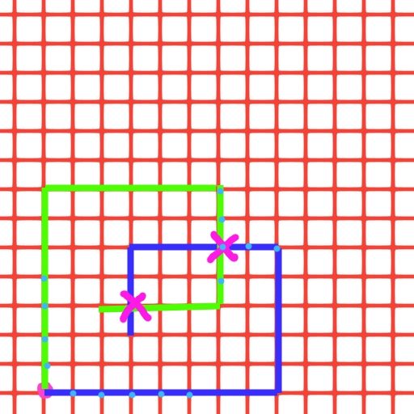

# [Day 3](https://adventofcode.com/2019/day/3)

## Part 1

### Problem

This situation situation is a bit hard to explain with only words but, I'll try. 

You have an infinite 2D grid in all directions. You take a random point on it that you define as the Origin (0,0) (the pink circle in my sketch below) .

Two wires start from this point, the wire must follow the grid line and move by integer value of unit. 
You can't have a wire that stop at a decimal distance of a grid intersection.

The path follows by this wire start from the origin is a list of commands. This directions are store in a file of N lines.
Each line is the path of one wire, which consists as comma separated value.

Each value follows a little protocol:
- the first character is the direction:
    - U : up
    - D : down
    - L : left
    - R : right
- the remaining of the value is the amount of the command

For example: `U15` says that the wire go up of 15 units. 

Sometimes the wires path will cross each other. Our job is to determine the Manhattan distance between the Origin and
the closest intersection point between wires.

We don't care about self-cross-intersection point.

### Testing values 

Example of path followed by two wires:

- `R8,U5,L5,D3`
- `U7,R6,D4,L4`

Their intersections are the purple cross

To help us teammates give us these configurations and waited distance:

- wire 1 : `R8,U5,L5,D3`
- wire 2 : `U7,R6,D4,L4`
- distance : `6`

___
- wire 1 : `R75,D30,R83,U83,L12,D49,R71,U7,L72`
- wire 2 : `U62,R66,U55,R34,D71,R55,D58,R83`
- distance : `159`

___
- wire 1 : `R98,U47,R26,D63,R33,U87,L62,D20,R33,U53,R51`
- wire 2 : `U98,R91,D20,R16,D67,R40,U7,R15,U6,R7`
- distance : `135`

### Resolution

- First we have write a function that loads wires path
- Then we need to find intersection between these two path
- Finally we need to implement a function that calculate the Manhattan distance from Origin (0,0).

### What i've learned ?

- How to create a macro.
- How to use an HashSet to efficiently intersect two sets of the same data.
