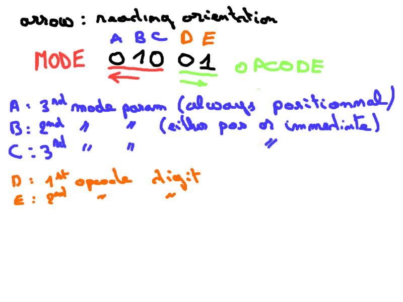

# [Day 5](https://adventofcode.com/2019/day/5)

## Part 1

### Problem

The day 5 involves to upgrade our day 2 computer to add some improvements.

First 2 new opcodes have been appended:
- `3` which allow to store data at a certain address store at nest value
- `4` which allow to buffer the result of the data contains at a certain address

Example:

If the input is `-42` and the program is `3,0,99` then the final state of memory will be `-42,0,99`
because we've stored the `-42` value at address `#0`.

The program `4,0,99` will display `4` then halt.

Another refinement is to allow mode on operand value. The previous computer only allowed getting value
at address. We want now to get the immediate value. To be clear the operand could be either a pointer to value or a value.

To model this the opcode have a little bit changed. Instead of being a simple integer it's now a string as follow:

There is now two parts; the two last digit are read left from right and represent the opcode like before. 
But it can have some digit at the left side of the opcode. This one parametrize the operand mode (pointer or value)

__Note__: The parametrization digit are omitted if all equals `0` : `1` === `0001`

If `B` is `1` then the second operand is the immediate value instead of an address.

So we should be able to read program like this `101,40,2,5,99,0` will be give us `101,40,2,5,99,42`, because the take the `40` the add to the content of the address `2` which value is `2` and store it to address `5`.

## Part 2

### Problem