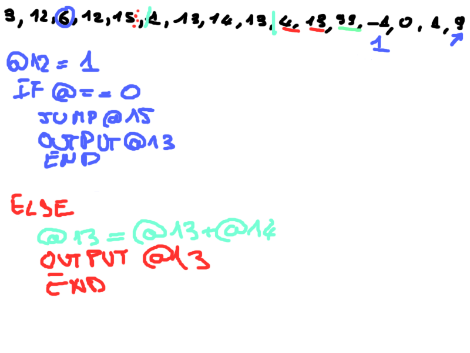
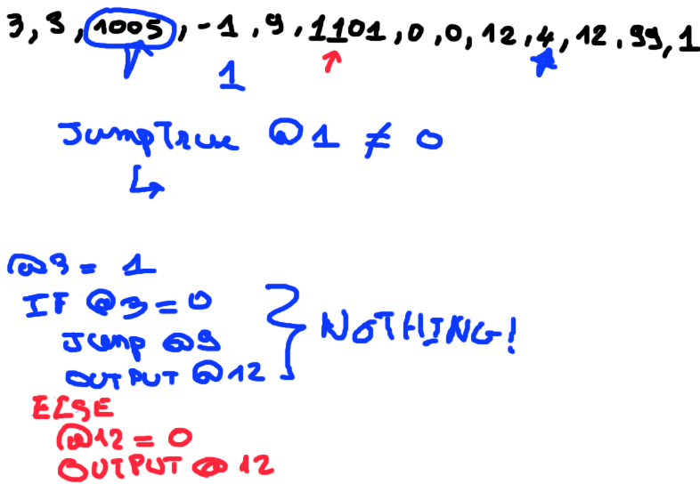

# [Day 5](https://adventofcode.com/2019/day/5)

## Part 1

### Problem

The day 5 involves to upgrade our day 2 computer to add some improvements.

First 2 new opcodes have been appended:
- `3` which allow to store data at a certain address store at nest value
- `4` which allow to buffer the result of the data contains at a certain address

Example:

If the input is `-42` and the program is `3,0,99` then the final state of memory will be `-42,0,99`
because we've stored the `-42` value at address `#0`.

The program `4,0,99` will display `4` then halt.

Another refinement is to allow mode on operand value. The previous computer only allowed getting value
at address. We want now to get the immediate value. To be clear the operand could be either a pointer to value or a value.

To model this the opcode have a little bit changed. Instead of being a simple integer it's now a string as follow:

There is now two parts; the two last digit are read left from right and represent the opcode like before. 
But it can have some digit at the left side of the opcode. This one parametrize the operand mode (pointer or value)

__Note__: The parametrization digit are omitted if all equals `0` : `1` === `0001`

If `B` is `1` then the second operand is the immediate value instead of an address.

So we should be able to read program like this `101,40,2,5,99,0` will be give us `101,40,2,5,99,42`, because the take the `40` the add to the content of the address `2` which value is `2` and store it to address `5`.

The instruction cursor no more increment systematically by `4` positions. Each opcode has it's own way
to deal with is parameters. For example `ADD` takes `3` parameters, the increment will be `4`, but `STORE`
only have `1` parameter thus the increment will be `2`.

### Resolution

Firstly first, I take some time to refactor my project, because the computer is used by both day02 and day05 project, I decide to extract it into a separate library project called `common`.

Because the opcode part have a bit changed, I need to refactor it to take in account the new parameter mode part. 

I also decide to define memory as an array of signed int instead of a unsigned integer list, to deal with program like:

`1101,100,-1,4,0` which stores `100 - 1` into address `4`

After this I append to my computer the new opcodes operation and implement their behavior.

As the increment can vary I dress a mapping between opcode and the number of parameter taken:
- `ADD` : 3
- `MULTIPLY` : 3
- `JUMP IF NON ZERO` : 3
- `JUMP IF ZERO` : 3
- `LESS THAN` : 2
- `EQUALS` : 2
- `STORE` : 1
- `OUTPUT` : 1
- `STOP` : 0

Because of the `STORE` and `OUTPUT` opcodes, I nedd to change the computer function signature, to add
in input a parameter to what'll be stored, I decide to use a `Option<i32>` to model it. I also need a output buffer.
Therefore the output is now a tuple `(Vec<i32>, Vec<String>)`, the first member is the state of the memory at program halt
and the second represents the buffer stack the program.

## Part 2

### Problem

In this part we'll implement 4 more opcodes:

- `5` which jumps to the second parameter address if the first parameter is `non-zero`
- `6` which jumps to the second parameter address if the first parameter is `zero`
- `7` which stores `1` in the memory address given by third parameter if the first parameter is less
than the second, stores `0` otherwise.
- `8` which stores `1` in the memory address given by third parameter if the first parameter is equals the second, stores `0` otherwise.

### Resolution

To solve this part we need to implement both the conditional jumps and logical operation of equality.

Below some program and their associated pseudo code. 

this program check whether input is a `1`, outputs `1` else `0`, using positional mode

same program but using immediate value

### What I've learned

How to split a rust projet into multiple library projects and inject them as dependency.

## Conclusion
I loved it. I create an ALU in Rust ❤️

## Puzzle mark

Language skills: ⭐⭐⭐⭐☆

Puzzle: ⭐⭐⭐⭐⭐

Background story : ⭐⭐⭐⭐☆ 