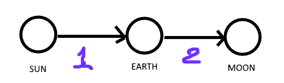
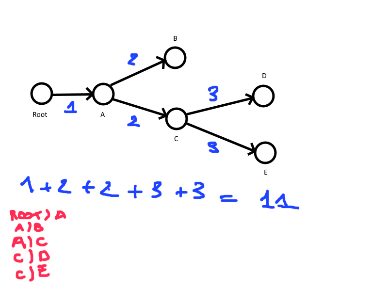
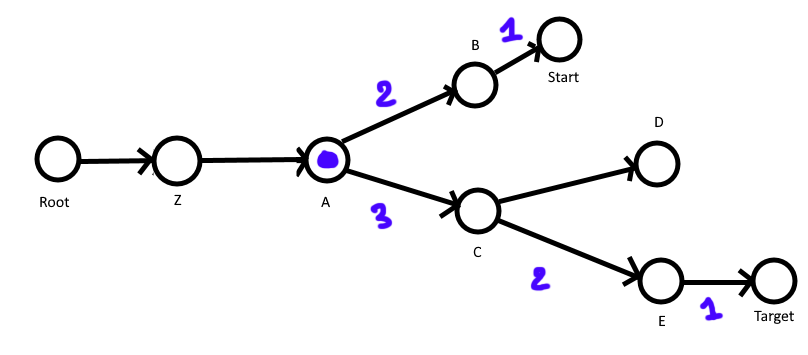

# [Day 6](https://adventofcode.com/2019/day/6)

## Part 1

### Problem

In this puzzle the idea is to count the sum of step separating the root of a tree and each of its node.

The file describing a graph is like below:

```
SUN)EARTH
EARTH)MOON
```
Will give us the following oriented graph

The sum of steps to reach sun from all nodes is `3`, one from `SUN` to `EARTH` and two from `SUN` to `MOON`



### Resolution

To solve this puzzle the idea is to recursively add the children times the depth of the node.

Example:

The blue number is the depth of the node.

- From the `Root` we visit all children, here `Root` has one child called `A` 
- we increment the depth counter 
- `A` has two child `B` and `C`
- we visit `B`, which has 0 child. So we do nothing
- We visit `C`, has 2 child `D` ans `E`, we increment the depth counter
- We visit `D`, has no child we do nothing
- We visit `E`, has no child we do nothing
- Has we have recursively visit all nodes we can multiplies the children count by node depth, layer by layer
- The sum layers value

so here : `3*2 + 2*2 + 1 = 11`

### What I've learned ?
- How to use an external crate from crates.io
- How to export a macro from another project



## Part 2

We know want the distance between two nodes.

The idea is to get all ancestors node from both `Target` and `Start` then remove the common nodes, the remaining is the path bettwen the two node `Target` and `Start`.

We just have to sum the two number of nodes remaining.



In this example the first common ancestor is A `A` the steps number to go from `A` to `Start` is `2`, and from `A` to `Target`, there is `3` steps.
So the total number between `Start` to `Target` is `2 + 3 = 5` passing by node `A`.

## Conclusion

At the beginning I tried to create my own "tree" structure, but the Rust is to strict and my knowledge to low to achieve this. 

So I switched to another solution, I used an external [library](https://docs.rs/indextree/4.0.0/indextree/), that build for this tree. I was battle with rust
concerning the reference and borrow checking. Get a precious help from the official [discord of rustlang](https://discordapp.com/channels/273534239310479360/273541522815713281).

## Puzzle mark

Language skills: ⭐⭐⭐⭐⭐

Puzzle: ⭐⭐⭐☆☆

Background story : ⭐⭐⭐⭐☆ 

