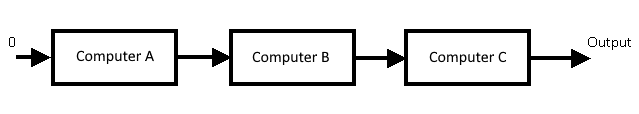

# [Day 7](https://adventofcode.com/2019/day/7)

## Part 1

### Problem

This puzzle reuse the Intcode computer develop in day 02 and day 07. The idea is to chain the output of previous computer as 
input of another computer.

In the real example there is 5 amplifiers ( our intcode computers ). These ones must be configure with a setting value.
This setting value is a number between 0 and 4. 

The question of the problem is to to determine the max final output, by trying each permutation of the five settings values,
with constraint of using a value only one time in the chain.

The output of computer A becomes  the input of computer B and so on, until the end of chain.
